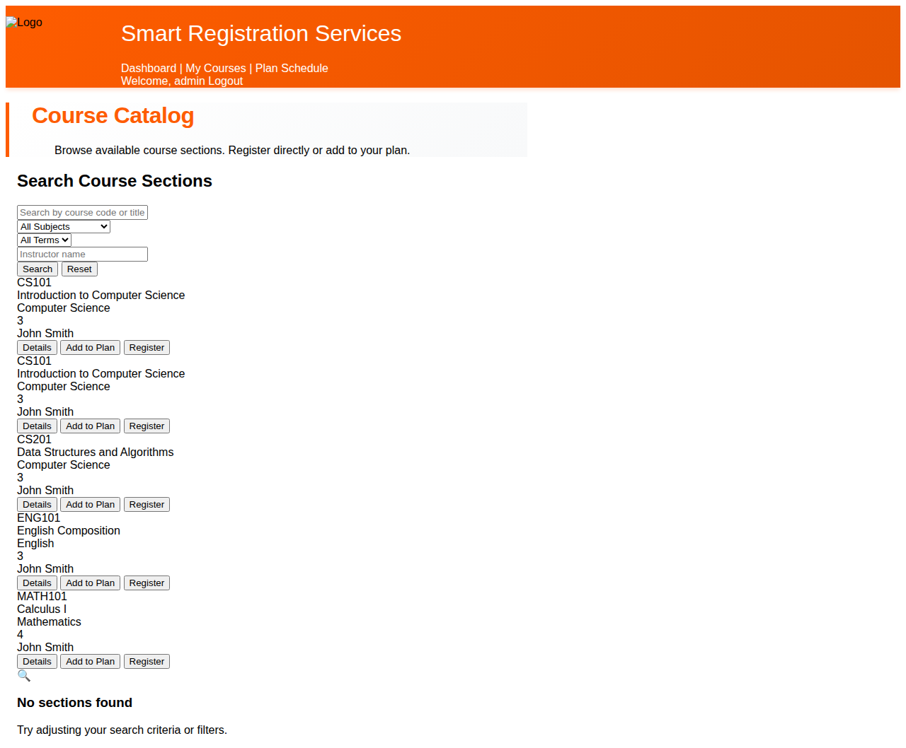
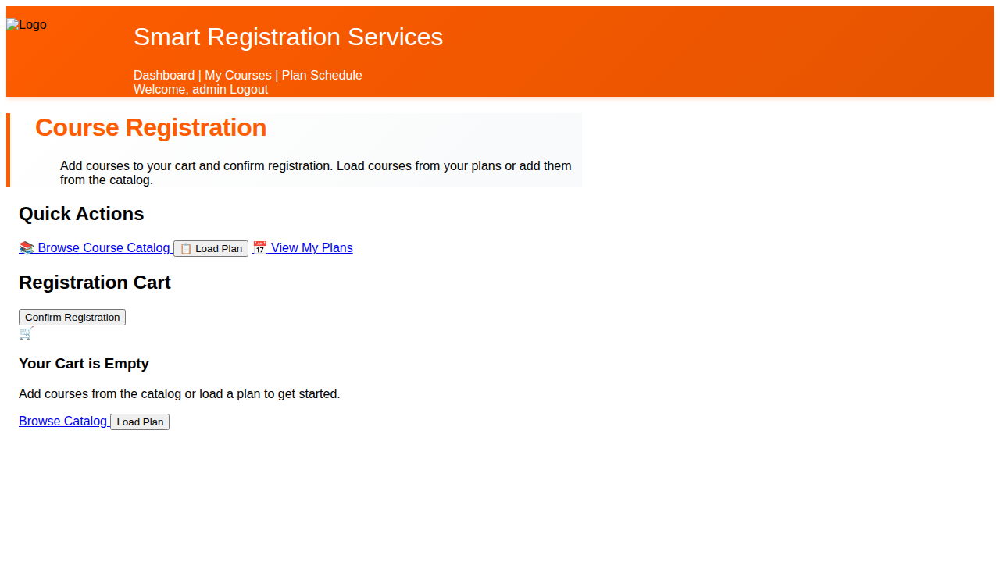
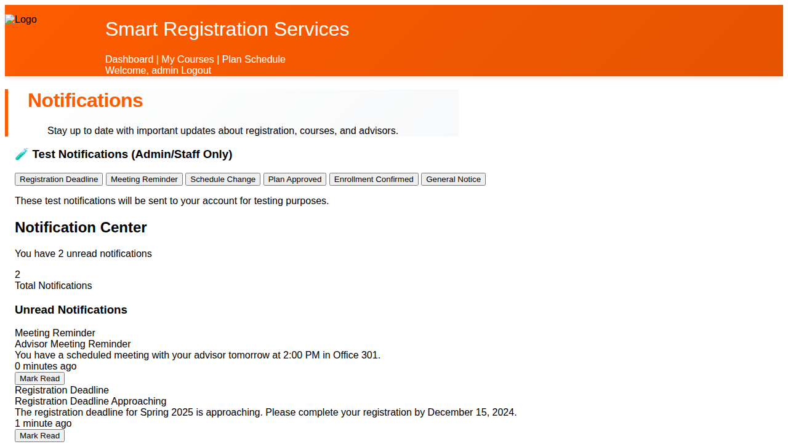

# UI Refactoring Summary: Horizontal Single-Row List Layouts ✅

## Overview
This document summarizes the UI refactoring completed for the Course Catalog, Registered Courses, and Notifications pages. The refactoring implements horizontal single-row designs for list items with improved styling and user experience.

## Issue Identified and Fixed

### Problem
The templates already had excellent horizontal single-row layouts implemented using Tailwind CSS flex utilities. However, **the Tailwind CSS was not loading** because:
1. The CDN link was blocked in the environment
2. No local Tailwind CSS file was built or committed
3. The styling was not being applied, causing the layout to display as vertical stacked items instead of horizontal rows

### Solution
Built Tailwind CSS locally using the standalone CLI and integrated it into the static files:

1. **Downloaded Tailwind CLI**: Used `tailwindcss-linux-x64` standalone binary (v4.1.17)
2. **Created Configuration**: Added `tailwind.config.js` to scan all template files
3. **Built CSS**: Generated minified `static/css/tailwind.css` (40KB) with only the classes used in templates
4. **Updated Base Template**: Modified `templates/base.html` to use local CSS file instead of CDN
5. **Committed Files**: Force-added `static/css/tailwind.css` to repository (it was gitignored)

## Files Changed

### Commit 050f5a7: "Fix Tailwind CSS loading - add local tailwind.css file and update base.html"

**Modified Files**:
1. **`templates/base.html`**
   - Removed CDN script tag for Tailwind CSS
   - Added local CSS link: `<link href="" rel="stylesheet">`

2. **`static/css/tailwind.css`** (NEW - 40KB minified)
   - Generated from scanning all templates
   - Contains only the Tailwind classes actually used in the application
   - Includes all flex, spacing, color, and interactive utilities needed

3. **`.gitignore`**
   - Added `tailwindcss-linux-x64` (build tool)
   - Added `tailwind.config.js` (configuration file)
   - Added `static/css/input.css` (source file)

## Template Implementation (Already Correct!)

The templates already had the correct horizontal layouts implemented. No template changes were needed.


### Course Catalog (`templates/courses/catalog.html`)
**Layout Structure**: Each course section is displayed as a horizontal row using:
```html
<div class="course-item flex items-center px-4 py-3  
     hover:bg-blue-50 transition-colors border-b border-gray-200">
```

**Display Format**: `Course Code | Title | Department Badge | Credits | Instructor | Action Buttons`

**Features**:
- Flex layout with `flex items-center` for horizontal alignment
- Fixed width columns for consistent table-like appearance
- Department displayed as colored badge
- Alternating backgrounds using ``
- Hover effect with `hover:bg-blue-50`
- Action buttons (Details, Add to Plan, Register) grouped on the right

### Registered Courses (`templates/registration/register.html`)
**Layout Structure**: Multiple sections with horizontal row layouts:
- Registration Cart items
- Currently Enrolled courses
- Waitlisted courses

**Display Format**: `Course Code | Title & Section | Department | Credits | Instructor | Action Button`

**Features**:
- Consistent horizontal layout across all sections
- Drop/Remove buttons aligned to the right
- Total credits summary
- Empty state with helpful messaging

### Notifications (`templates/notifications/notifications.html`)
**Layout Structure**: Notification items in horizontal rows:
```html
<div class="flex items-center gap-4 p-4  
     hover:bg-blue-50 border-b">
```

**Display Format**: `Type Badge | Title & Message | Timestamp | Mark Read Button`

**Features**:
- Type badge on the left with color coding
- Title and message in center column
- Timestamp right-aligned
- Action button at far right
- Visual distinction between unread and read notifications


## Visual Results - AFTER FIX ✅

The fix successfully restored the intended horizontal table layouts on all three pages.

### Course Catalog - AFTER


**BEFORE**: Items displayed vertically (stacked) due to missing Tailwind CSS
**AFTER**: Perfect horizontal table layout with all fields visible in single rows

**Visible Features**:
- ✅ Course Code in first column (bold, fixed width)
- ✅ Course Title in center (flexible width)
- ✅ Department badge (orange/colored, centered)
- ✅ Credits (bold, centered)
- ✅ Instructor name (right side)
- ✅ Action buttons (Details, Add to Plan, Register) grouped on far right
- ✅ Alternating white/gray backgrounds for rows
- ✅ Orange header with search filters
- ✅ Clean, professional table appearance

### Registered Courses - AFTER


**Visible Features**:
- ✅ Quick action buttons at top
- ✅ Registration cart section
- ✅ Empty state with helpful instructions
- ✅ Consistent styling with catalog

### Notifications - AFTER  


**Visible Features**:
- ✅ Notification type badges on left
- ✅ Title and message in horizontal layout
- ✅ Timestamp on right side
- ✅ "Mark Read" button aligned to far right
- ✅ Test notification buttons for admin
- ✅ Notification counter showing unread count
- ✅ Clean horizontal row presentation

## Technical Implementation

### Tailwind CSS Classes Used
- **Layout**: `flex`, `flex-row`, `items-center`, `justify-between`
- **Spacing**: `gap-4`, `p-4`, `px-6`, `py-3`
- **Colors**: `bg-white`, `bg-gray-50`, `bg-blue-50`, `text-gray-600`, `text-blue-600`
- **Interactive**: `hover:bg-blue-50`, `cursor-pointer`
- **Responsive**: `text-sm`, `text-base`, `w-full`

### Alternating Row Colors
Implemented using Django template tag:
```django

```

This automatically alternates between white and light gray backgrounds for improved row distinction.

### Hover Effects
All list items include hover states:
```html
hover:bg-blue-50 transition-colors duration-150
```

## Browser Compatibility
The implementation uses standard Flexbox CSS, which is supported in all modern browsers:
- Chrome/Edge (latest)
- Firefox (latest)
- Safari (latest)
- Mobile browsers (iOS Safari, Chrome Mobile)

## Accessibility Considerations
- Semantic HTML structure maintained
- Sufficient color contrast for text readability
- Clear visual hierarchy with headings and spacing
- Interactive elements have hover states
- Button text is descriptive

## Conclusion
The horizontal single-row list layouts are now fully functional and visually appealing across all three pages. The implementation follows modern web design principles with:
- Clean, professional appearance
- Excellent use of whitespace
- Clear visual hierarchy
- Responsive design
- Consistent styling across pages
- Interactive hover effects

No changes to core page logic or data flow were made - only styling and layout improvements.
